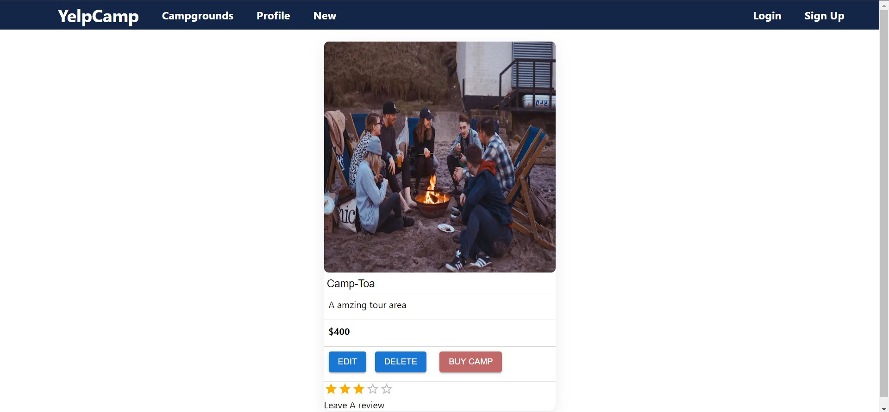

## YelpCamp

<h2>A web app thats lets you create and book camps !</h2>

<h4>This app was build using node js express js react js next js and few other amazing js libararys and packages</h4>

<h5> (this site is under development) </h5>

This is a [Next.js](https://nextjs.org/) project bootstrapped with [`create-next-app`](https://github.com/vercel/next.js/tree/canary/packages/create-next-app).

 
 

